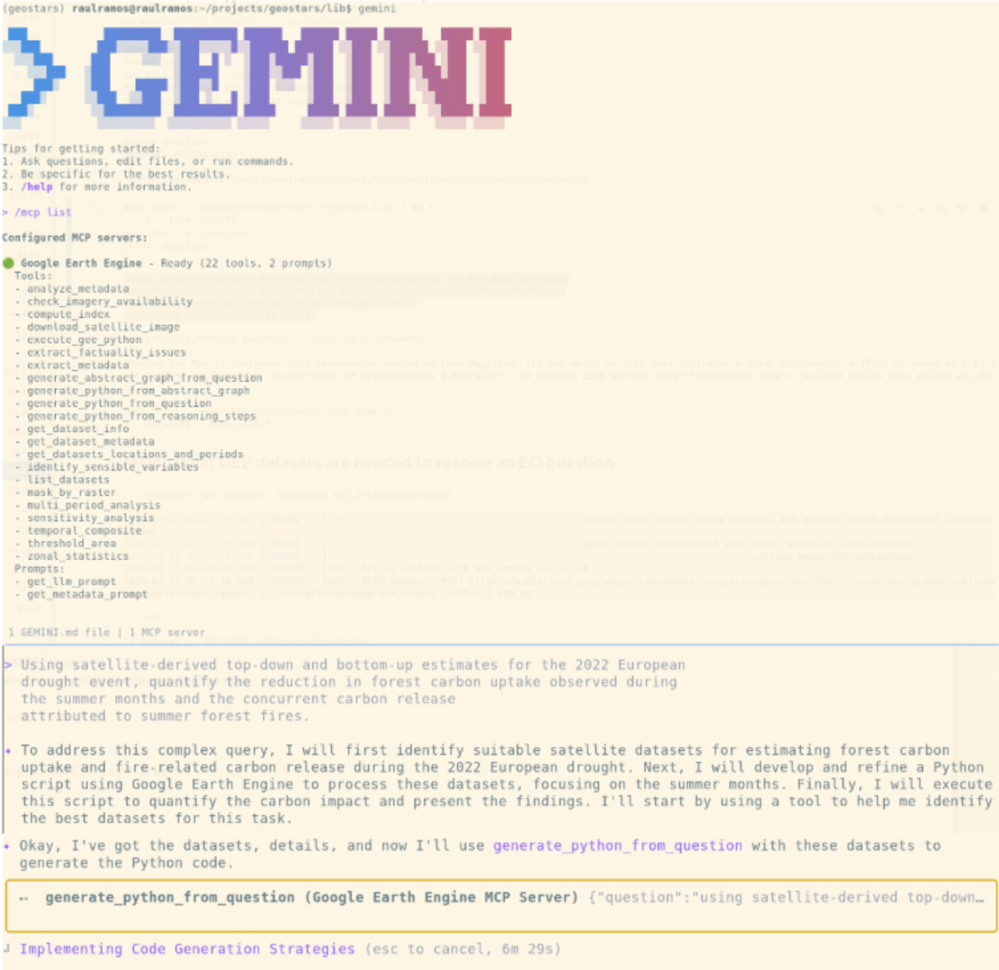
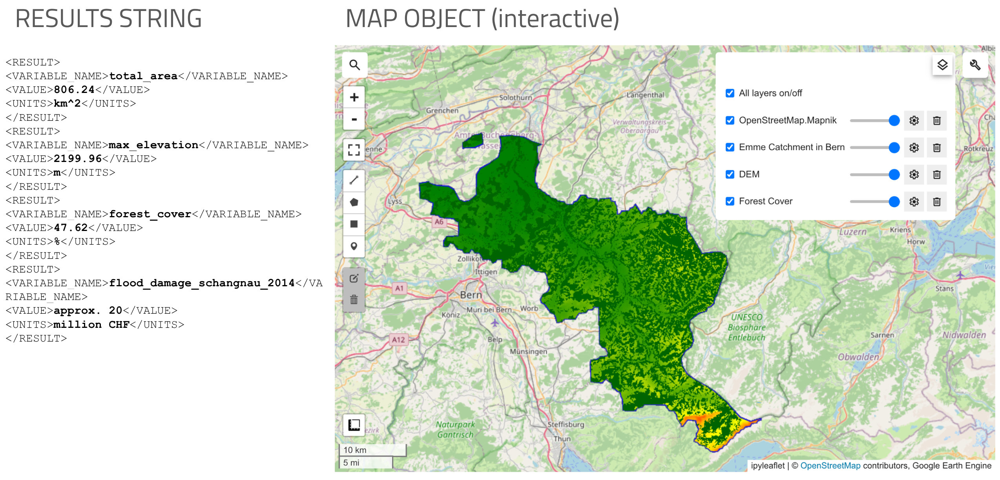

# GEE MCP

[](https://github.com/FrontierDevelopmentLab/gee-mcp/actions/workflows/main.yml)
[](https://github.com/FrontierDevelopmentLab/gee-mcp)
[](LICENSE)

An [MCP](https://modelcontextprotocol.io/) server that exposes
[Google Earth Engine](https://earthengine.google.com/) (GEE) as a set
of MCP tools — dataset discovery, metadata extraction, analysis
primitives, and AI-assisted GEE Python code generation.

> **Status: alpha (v0.0.1) — work in progress.** APIs, tool names, and
> wire formats may change without notice. Not yet recommended for
> production use.

## Tools

The server registers the following MCP tools, grouped by purpose.

### Catalogue & Metadata
- `list_datasets` — list all available Google Earth Engine datasets.
- `get_dataset_info` — get detailed Markdown information about a GEE
  dataset.
- `get_dataset_metadata` — get structured STAC metadata (bands,
  temporal interval, etc.) for a dataset.
- `check_imagery_availability` — check imagery availability for a
  dataset within a date range and optional bounding box.
- `extract_metadata` — extract structured metadata (bands, pixel
  size, availability, cadence) from a dataset page.
- `analyze_metadata` — use Gemini to analyse a dataset description
  and extract structured metadata.

### Analysis & Data Processing
- `download_satellite_image` — download satellite images from GEE.
- `compute_index` — compute a spectral index (NDVI, NDWI, …) or a
  custom band-math expression over a region.
- `zonal_statistics` — compute summary statistics (mean, median,
  min, …) for bands or an index within a region.
- `temporal_composite` — create cloud-free temporal composites
  (median, mosaic, greenest, most recent).
- `mask_by_raster` — apply a value-range mask (DEM, land cover, …)
  to imagery and compute statistics.
- `threshold_area` — compute the area of pixels meeting a threshold
  condition on a band, index, or expression.
- `multi_period_analysis` — run the same analysis across multiple
  date ranges for temporal comparisons.
- `execute_gee_python` — execute a provided GEE Python script and
  return the result.

### AI Code Generation & Validation
- `generate_python_from_question` — answer an Earth Observation
  question by generating GEE Python code with iterative error fixing.
- `generate_abstract_graph_from_question` — generate an abstract
  Mermaid graph describing an EO pipeline that solves a question.
- `generate_python_from_reasoning_steps` — generate GEE Python code
  from a provided set of reasoning steps.
- `generate_python_from_abstract_graph` — generate GEE Python code
  from a provided Mermaid graph.
- `get_datasets_locations_and_periods` — determine the GEE datasets,
  time periods, and AOIs required to answer a question.
- `extract_factuality_issues` — analyse a GEE Python script and
  surface scientific assumptions worth verifying.
- `assess_factuality_issue` — produce an expert-style assessment of
  a factuality issue, with optional code-fix recommendations.
- `identify_sensible_variables` — identify variables and constants
  in the code whose values might affect the final result.
- `sensitivity_analysis` — perform sensitivity analysis by tweaking
  variable values and plotting the impact on the final result.

## Example tool invocation

A JSON-RPC call to `generate_python_from_question` looks like:

```json
{
  "method": "tools/call",
  "params": {
    "name": "generate_python_from_question",
    "arguments": {
      "question": "Calculate the average NDVI over the Amazon basin for the year 2023.",
      "fix_code": true
    }
  }
}
```

The response includes:

- `python_code` — the generated GEE Python code,
- `python_code_explanation` — an explanation of the code,
- `python_code_fix_history` — the iterative fixes attempted,
- `python_code_result` — the result of executing the code.

The generated code defines `gee_main()` returning `(result_xml, Map)`,
where `result_xml` follows a `<RESULT><VARIABLE_NAME>...
</VARIABLE_NAME><VALUE>...</VALUE><UNITS>...</UNITS></RESULT>` shape,
and `Map` is a `geemap.Map` for notebook display.

## Installation

The project uses [Poetry](https://python-poetry.org/).

```bash
git clone https://github.com/FrontierDevelopmentLab/gee-mcp.git
cd gee-mcp
poetry install
```

Supported Python versions: 3.11–3.14.

## Configuration

You need to configure access to **Gemini** and to **Google Earth
Engine** via environment variables. Copy [`.env.example`](.env.example)
to `.env` and fill in the values; `python-dotenv` is loaded on server
startup.

### Gemini

Either set an API key:

| Variable | Required | Purpose |
| --- | --- | --- |
| `GEMINI_API_KEY` or `GOOGLE_API_KEY` | yes (one of the two) | Gemini API key |

…or use a Vertex AI project (after running `gcloud auth
application-default login`):

| Variable | Required | Default | Purpose |
| --- | --- | --- | --- |
| `VERTEXAI_PROJECT` | yes | — | GCP project ID for Vertex AI |
| `VERTEXAI_LOCATION` | no | `global` | GCP region for Vertex AI |

### Google Earth Engine

| Variable | Required | Purpose |
| --- | --- | --- |
| `GEE_PROJECT` | yes | GEE project ID |
| `GEE_KEY_PATH` | no | Path to a service-account JSON key file |
| `GEE_SERVICE_ACCOUNT` / `EE_SERVICE_ACCOUNT` | no | Service-account email |
| `GEE_PRIVATE_KEY_PATH` / `GOOGLE_APPLICATION_CREDENTIALS` | no | Path to private key |
| `GEE_AUTH_MODE` | no | Auth mode for `ee.Authenticate` (default `gcloud`) |
| `GEE_SKIP_AUTH` | no | Set to `1` to skip auth entirely (used by the test suite) |

The auth chain tries, in order: explicit key file (param or
`GEE_KEY_PATH`), env-var service account, default user credentials,
then interactive `ee.Authenticate`. You typically just need
`GEE_PROJECT` after running `earthengine authenticate` or `gcloud auth
application-default login`.

## Running the server

Over stdio (the standard MCP transport):

```bash
poetry run python -m gee_mcp.server
```

## Testing with the example client

The repo includes `client.py`, an example MCP client that launches
the server as a subprocess.

```bash
poetry run python client.py
```

See `example.ipynb` for a notebook walk-through.

## Integration

GEE MCP can be plugged into any MCP-aware agent. For example, in
Gemini-CLI:



For the question:

> Characterize the morphometry and land cover of the Emme catchment
> in the Canton of Bern by determining its total area, maximum
> elevation, and forest cover percentage. Additionally, state the
> financial magnitude of the damages caused by the flash flood event
> in this catchment (specifically in Schangnau) during July 2014.

the generated code returns:



## Development

Install the pre-commit hooks once:

```bash
poetry run pre-commit install
```

Run the full hook suite (detect-secrets, autoflake, black, isort,
mypy, pylint, pytest+coverage):

```bash
poetry run pre-commit run --all-files
```

Run just the tests:

```bash
poetry run pytest
```

## Acknowledgements

Originally created by [Raúl Ramos](https://github.com/rramosp).

## License

MIT — see [LICENSE](LICENSE).
